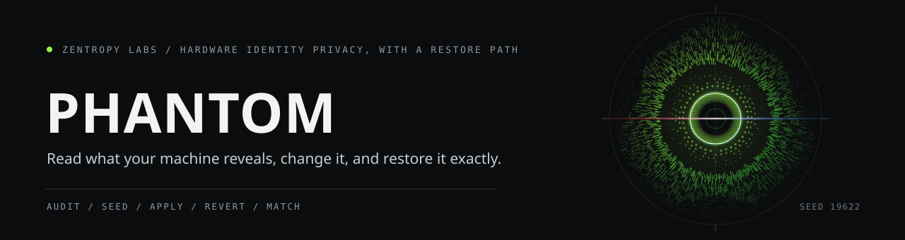

# Phantom

<p align="center">
  
</p>

Hardware identity privacy for authorized Windows and Linux systems.

Every application on your machine can read dozens of unique hardware identifiers: motherboard serials, disk serials, MAC addresses, GPU device IDs, TPM module IDs, the Windows registry machine GUID, the Linux machine ID. Software uses these to fingerprint your device, track it across reinstalls, and build a permanent hardware dossier without your knowledge or consent.

Phantom audits what your machine reveals, generates internally consistent identity profiles, and applies them to the identifiers software reads most often. It backs up every original value before it writes, and restores them exactly on revert or uninstall.

Phantom is for machines you own or are expressly authorized to test. It is not a tool for evading fraud controls or misrepresenting a device you do not control.

## Who this is for

Phantom serves operators who need to control what their hardware reports to software running on it. Concrete use cases:

- **Penetration testers and red teams** who rotate hardware identity between assessments so residual fingerprints from one engagement do not contaminate the next.
- **QA and device-testing teams** who need to validate software behavior across a range of hardware profiles without maintaining a physical device lab.
- **Privacy researchers** studying how applications fingerprint and track devices, and what identifiers carry the most weight.
- **Enterprise IT and fleet management** teams provisioning standardized device identities across imaging pipelines.
- **Forensic and incident-response analysts** who build isolated examination environments and need to control which identifiers the examined software sees.

Phantom is a privacy and authorized-testing tool. It does not target anti-cheat systems, game services, or fraud-detection infrastructure. Its Terms of Use prohibit financial fraud, evasion of lawful court orders, and criminal activity in any jurisdiction.

![Eight stages of applying a hardware identity: audit, generate, consistent, capture, backup, write, validate, and revert. The audit reads seven identifier sources and writes nothing. Generate hashes one seed string with SHA-256 and uses the result to key a ChaCha20 stream, so the same seed rebuilds the same identity on any machine. The generated values stay internally consistent: a Samsung disk serial carries Samsung's format, and an Intel network adapter takes one of the registered Intel prefixes. Capture reads each live registry value together with the type it is stored under, because a string written where a number belongs corrupts the value. The backup is saved to disk before a single write happens. Then the identifiers are written: five registry values on Windows, three on Linux. Validate re-reads every source and compares it field by field. Revert restores each original at the type it was recorded under. Three outcomes: originals kept, nothing written, and modeled only.](docs/art/apply-lane.svg)

## What v1.1.0 does

- **Audit.** Read and report every hardware identifier software can see on this machine. Nothing is modified.
- **Generate.** Build a realistic, internally consistent identity profile from a seed. Samsung disk serials match Samsung's format; Intel MACs use real Intel OUI prefixes. One seed reproduces the same identity every time.
- **Apply (Layer 2).** On Windows, spoof the five registry identifiers that carry the most fingerprinting weight. On Linux, spoof the machine ID, the hostname, and the MAC of each physical interface. See [What apply changes](#what-apply-changes).
- **Validate.** Confirm every identifier source reports consistently after an apply.
- **Revert.** Restore the exact original values, from a backup written before the first change.

Layer 1 (kernel driver) and Layer 0 (UEFI/DXE firmware) are modeled but not shipped. See [Scope](#scope).

## Getting started on Windows

### 1. Download and verify

Download `PhantomSetup-v1.1.0.msi` from [Releases](https://github.com/HarperZ9/phantom/releases), along with `SHA256SUMS.txt`. Verify it before running:

```
certutil -hashfile PhantomSetup-v1.1.0.msi SHA256
```

Compare the output to the matching line in `SHA256SUMS.txt`.

### 2. Install

Double-click the MSI. The installer is not yet code-signed, so Windows SmartScreen shows "Windows protected your PC". Click **More info**, then **Run anyway**. Accept the UAC prompt and the license agreement. Three components install to `C:\Program Files\Phantom\`: the `phantom.exe` CLI, the `phantom-svc.exe` background service that reapplies your active profile across reboots, and the `phantom-tray.exe` status indicator.

### 3. Use it

Applying writes machine-wide registry keys, so run `apply` and `revert` from an **elevated** terminal (right-click > Run as administrator).

```
phantom --version                       # reports phantom 1.1.0
phantom audit                           # read-only: see your starting exposure
phantom profile generate my-profile
phantom apply my-profile --layers 2     # elevated
phantom validate my-profile
phantom revert                          # elevated: restore the originals
```

## Getting started on Linux

Phantom ships as a `.deb`, an `.rpm`, and a portable tarball. All three install the CLI, the service binary, and a systemd unit. `apply` and `revert` need root, and setting a MAC needs `iproute2`.

### 1. Install

```
# Debian / Ubuntu
sudo apt-get install ./phantom_1.1.0-1_amd64.deb

# Fedora / RHEL / openSUSE
sudo dnf install ./phantom-1.1.0-1.x86_64.rpm      # or: sudo zypper install ...

# Any distro (portable tarball)
tar -xzf phantom-1.1.0-x86_64-linux.tar.gz && cd phantom-1.1.0-x86_64-linux && sudo ./install.sh
```

Installing enables `phantom.service`, which reapplies your active profile on boot. Nothing changes on your machine until you run an explicit `apply`.

### 2. Use it

```
phantom --version
phantom audit                           # read-only
phantom profile generate my-profile
sudo phantom apply my-profile           # spoof machine-id, hostname, and MAC
phantom validate my-profile
sudo phantom revert                     # restore the originals
```

A spoofed MAC does not survive a reboot on its own, so `phantom.service` reapplies it at boot. machine-id and hostname are file-based and persist on their own. This is verified on a real Linux VM through a power-cycle (see `docs/linux-vm-dogfood.md`). Full install detail is in [docs/linux-install.md](docs/linux-install.md).

### License activation (both platforms)

Phantom runs in **Free** tier immediately, which covers Layer-2 spoofing and up to two profiles. A **Pro** or **Enterprise** key raises the profile limit and unlocks the deferred layers as they ship.

```
phantom license request          # prints an enrollment block to send your licensing contact
phantom license activate <key>   # activate the key they issue back
```

Activation shows the Terms of Use and Privacy Notice. Answer `y` at each prompt (or pass `--accept-tou --acknowledge-privacy-notice` for unattended installs).

![Twelve rows covering what a generated profile holds and where each part gets its shape. The seed is one string, hashed with SHA-256 into a ChaCha20 stream, so the same seed rebuilds the same identity on any machine. Four board vendors, ASUSTeK, Gigabyte, Micro-Star and ASRock, each carrying its own serial prefix, length, character set and BIOS vendor string. Four disk vendors, Samsung, Western Digital, Seagate and Crucial. Four network vendors, Intel, Realtek, Broadcom and Qualcomm, drawn from eighteen registered OUI prefixes rather than random leading bytes. Fourteen GPU models, eight NVIDIA and six AMD, each with the real PCI device id it carries. Four TPM vendors and seven display vendors under the three letter EDID codes the standard assigns. On Windows five registry values are applied: MachineGuid, HwProfileGuid, MachineId, ProductId and InstallDate, four strings and one number. On Linux three identifiers are applied: machine id, hostname, and the MAC of each physical interface. The accented row is the computer name, which is modeled and deliberately not applied, because writing it at the registry level alone desyncs the machine name and breaks shutdown and WMI. The backup is written before any value changes, and a second apply keeps the first one. Profile limits run two, fifty, and unlimited across the three tiers.](docs/art/identity-table.svg)

## What apply changes

At Layer 2, `apply` spoofs the userland-reversible identifiers, the ones an ordinary process reads and that Phantom can change and restore exactly without touching firmware.

**Windows** (five registry identifiers):

| Identifier | Registry location |
|---|---|
| MachineGuid | `HKLM\SOFTWARE\Microsoft\Cryptography\MachineGuid` |
| HwProfileGuid | `HKLM\SYSTEM\CurrentControlSet\Control\IDConfigDB\Hardware Profiles\0001` |
| MachineId | `HKLM\SOFTWARE\Microsoft\SQMClient\MachineId` |
| ProductId | `HKLM\SOFTWARE\Microsoft\Windows NT\CurrentVersion\ProductId` |
| InstallDate | `HKLM\SOFTWARE\Microsoft\Windows NT\CurrentVersion\InstallDate` |

ComputerName is modeled but deliberately not applied on Windows: writing it at the registry level alone desyncs the machine name and breaks `shutdown`, `Restart-Computer`, and WMI, so it waits for a full rename path.

**Linux** (three identifiers):

| Identifier | Location |
|---|---|
| machine-id | `/etc/machine-id` and `/var/lib/dbus/machine-id` |
| hostname | `/etc/hostname` and the live `sethostname()` |
| MAC (per physical interface) | `ip link set dev <if> address` |

Hostname is safe to spoof at Layer 2 on Linux, unlike Windows, so `apply` changes it there.

A profile *models* a much wider identifier set (SMBIOS and board serials, disk serials, GPU, TPM, display, boot) so it stays internally consistent as higher layers land. Everything outside the tables above is modeled, not yet applied, because it lives in firmware or the kernel (Layers 0 and 1).

## Tiers and licensing

| Tier | Layers | Profiles | Background service |
|------|--------|----------|--------------------|
| Free | Layer 2 | 2 | No |
| Pro | All layers as they ship | 50 | Yes |
| Enterprise | All layers as they ship | Unlimited | Yes |

Keys are HMAC-signed and bound to one machine's hardware fingerprint: a key issued for your machine is worthless on any other. `phantom license request` prints the fingerprint and build details your licensing contact needs; they issue a key bound to it. Full details in [docs/user/licensing.md](docs/user/licensing.md).

## CLI reference

```
# Audit (read-only)
phantom audit

# Profiles
phantom profile generate <name> [--seed "memorable-string"]
phantom profile show <name>
phantom profile list
phantom profile export <name> > profile.json
phantom profile import profile.json
phantom profile delete <name>

# Apply / validate / revert  (apply and revert need elevation on Windows, root on Linux)
phantom apply <name> --layers 2
phantom validate <name>
phantom revert
phantom status

# Licensing
phantom license request
phantom license activate <key> [--accept-tou --acknowledge-privacy-notice]
phantom license status
phantom license fingerprint
phantom license deactivate

# Configuration
phantom config show
phantom config path
phantom config set <key> <value>

# Legal + integrity
phantom privacy-notice
phantom tou
phantom self-check
phantom tamper-report

# Machine-readable output (stable JSON envelope): add --json to most commands
phantom --json status
phantom --json audit
```

## Configuration

Phantom resolves configuration in this order (highest wins): environment variables (`PHANTOM_*`), then a JSON config file, then compiled defaults.

| Variable | Default (Windows) | Default (Linux) | Description |
|----------|---------|---------|-------------|
| `PHANTOM_DATA_DIR` | `%ProgramData%\Phantom` | `/var/lib/phantom` | Machine-wide store for profiles, logs, config, backup, and license state |
| `PHANTOM_LOG_LEVEL` | `info` | `info` | `trace`, `debug`, `info`, `warn`, `error` |
| `PHANTOM_CONFIG` | `<data_dir>/config.json` | `<data_dir>/config.json` | Alternate config-file location |
| `PHANTOM_TELEMETRY` | `false` | `false` | Opt-in telemetry |

## Privacy and phone-home

Phantom does not phone home unless you set a callback URL. When you do, it sends a minimal, signed payload (an opaque license serial, the tier, the Phantom version, a timestamp, and tripwire counts) at most once per interval, over `curl` so the call is visible to your host tooling. No hardware fingerprint, profile content, or machine identity leaves the machine. Disable it any time with `phantom config set phone_home_enabled false`. See [docs/user/privacy.md](docs/user/privacy.md) and `phantom privacy-notice`.

## Uninstall

On either platform, removal reverts every applied identifier from its backup first, so you are never left with a spoofed identity and no tool to restore it. Your profiles, license, and config remain in the data directory so a reinstall resumes where you left off; delete that directory to wipe everything.

```
# Windows: Settings > Apps, or the MSI
# Debian / Ubuntu
sudo apt-get remove phantom
# Fedora / RHEL
sudo dnf remove phantom
# Tarball install
sudo ./uninstall.sh
```

## System requirements

- **Windows** 10 22H2 or Windows 11 23H2 or newer; Administrator privileges for install, apply, and revert.
- **Linux** with systemd; root for apply and revert; `iproute2` for MAC spoofing.
- x86-64.

![Eight stages of validating an applied identity: sources, firmware, registry, devices, expect, compare, status, and report. Seven readers run, each one independent of the others. The firmware reader parses the SMBIOS table out of its raw bytes rather than asking an operating system service for a summary. The registry reader reads back the five Layer 2 values. The device readers enumerate disks, network adapters, GPUs, displays, and the TPM. Against each reading stands the profile field that identifier is supposed to carry. The two are compared, and each field lands on match, mismatch, or unavailable. The result is a diff a person can read, or the same content in the stable JSON envelope. Three outcomes: match, mismatch, and unavailable.](docs/art/validate-lane.svg)

## Scope

Phantom ships the Layer-2 path on both platforms, verified end to end (audit, generate, apply, validate, revert, reboot persistence, and clean uninstall) on fresh Windows and Linux VMs. It is honest about its edges:

- **Layer 2 only.** Layers 1 (kernel driver) and 0 (UEFI/DXE firmware) are modeled but not shipped. The Layer 1 kernel driver now compiles in CI and two of its security defects are fixed, but it is unsigned and not yet functional end to end. See `docs/kernel-driver-review.md` and `docs/windows-driver-signing.md`.
- **Unsigned.** The Windows MSI is not yet code-signed; SmartScreen will warn until a signing certificate is in place. The Linux packages ship with published `SHA256SUMS.txt`.
- **Authorized use.** Intended for machines you own or are expressly authorized to test.

## License

Proprietary. See [LICENSE](LICENSE).
